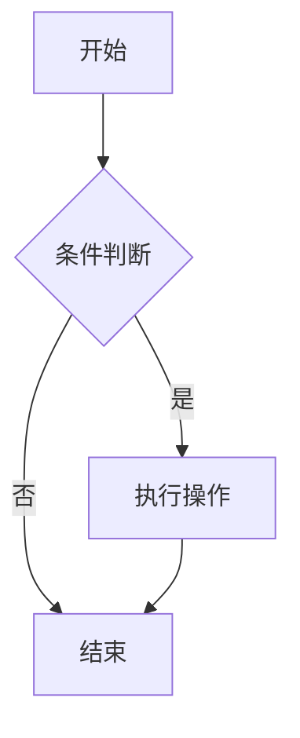
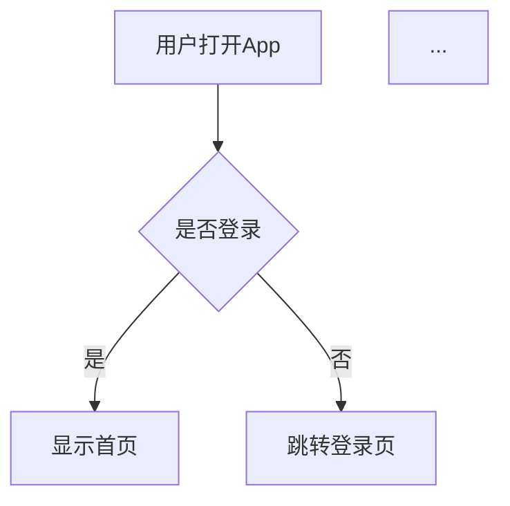

# PRD 写作 Skill

一个专业的Claude Code技能，帮助你撰写结构清晰、内容完整的产品需求文档（PRD），并支持在文档中生成产品原型图。

## 特性

✅ **标准PRD结构** - 遵循业界最佳实践的PRD文档结构
✅ **产品原型图** - 支持使用Mermaid图表、ASCII艺术和详细描述来绘制原型
✅ **用户故事** - 提供完整的用户故事编写指南和模板
✅ **完整性检查** - 包含PRD检查清单，确保文档完整性
✅ **丰富示例** - 提供大量实用的模板和示例

## 安装

这个Skill已经安装在项目的 `.claude/skills/prd-writing-skill/` 目录中，会自动被Claude Code识别。

如果你想在其他项目中使用，可以：

### 方法1：项目级别安装（团队共享）
```bash
# 复制到项目的.claude/skills目录
cp -r .claude/skills/prd-writing-skill /path/to/your/project/.claude/skills/
```

### 方法2：全局安装（个人使用）
```bash
# 复制到用户目录
cp -r .claude/skills/prd-writing-skill ~/.claude/skills/
```

## 使用方法

### 自动激活
当你向Claude提出以下类型的请求时，Skill会自动激活：
- "帮我写一个PRD"
- "创建产品需求文档"
- "完善这个PRD的功能规划部分"
- "画一下用户流程图"

### 手动调用
你也可以显式地调用Skill：
```
/skill prd-writing-skill
```

## 支持的原型图类型

### 1. Mermaid图表
- **流程图（Flowchart）** - 用户流程、业务流程
- **序列图（Sequence Diagram）** - 系统交互、API调用
- **状态图（State Diagram）** - 订单状态、审核流程
- **实体关系图（ER Diagram）** - 数据模型
- **甘特图（Gantt Chart）** - 项目时间线
- **类图（Class Diagram）** - 系统架构

示例：


### 2. ASCII艺术界面
用于绘制移动端和Web端的界面布局：

```
┌─────────────────────────┐
│  ☰  Logo    🔍  👤     │  <- 导航栏
├─────────────────────────┤
│                         │
│  主要内容区域            │
│                         │
├─────────────────────────┤
│ [首页] [分类] [我的]    │  <- 底部Tab
└─────────────────────────┘
```

### 3. 详细界面描述
对于复杂交互或无法绘制的情况，使用结构化的文字描述。

## 文件结构

```
.claude/skills/prd-writing-skill/
├── SKILL.md                           # Skill核心文件（配置+指令）
├── README.md                          # 本文件
├── references/                        # 参考文档
│   ├── prd-template.md               # 完整的PRD模板
│   ├── prototype-examples.md         # 各种原型图示例
│   └── user-story-template.md        # 用户故事模板
└── assets/                            # 资源文件
    └── prd-checklist.json            # PRD完整性检查清单
```

## 使用示例

### 示例1：创建新PRD
```
User: 帮我写一个电商移动应用的PRD，包括用户注册、商品浏览、购物车和下单功能。

Claude: [使用prd-writing-skill]
我来帮你创建一个完整的PRD文档...
[生成包含原型图的PRD]
```

### 示例2：画用户流程图
```
User: 画一下用户从登录到下单的完整流程图

Claude: [使用prd-writing-skill]

```

### 示例3：完善现有PRD
```
User: 这个PRD缺少技术架构部分，帮我补充一下

Claude: [使用prd-writing-skill]
我来为你补充技术架构部分...
[添加技术架构图和说明]
```

## PRD标准结构

使用这个Skill生成的PRD包含以下标准部分：

1. **产品概述** - 产品定位、愿景、目标用户
2. **市场分析** - 市场机会、竞品分析、差异化优势
3. **用户研究** - 用户画像、用户旅程、用户故事
4. **功能规划** - 功能架构、优先级、详细规格
5. **产品原型** - 信息架构、界面原型、交互说明
6. **技术要求** - 技术架构、性能、安全、数据模型
7. **成功指标** - KPI、用户指标、业务指标
8. **项目规划** - 里程碑、版本规划、资源需求、风险
9. **附录** - 术语表、参考资料、变更历史

## 最佳实践

### 1. 明确需求
在请求Claude编写PRD之前，尽可能提供：
- 产品的核心目标和价值主张
- 目标用户群体
- 主要功能列表
- 技术约束或偏好

### 2. 迭代完善
不要期望一次生成完美的PRD。可以：
- 先生成大纲，再逐步细化
- 针对某个部分要求更多细节
- 根据反馈不断调整

### 3. 结合图表
充分利用Skill的原型图功能：
- 用流程图展示用户旅程
- 用序列图说明系统交互
- 用ER图展示数据模型
- 用ASCII艺术展示界面布局

### 4. 保持更新
PRD是活文档，应该：
- 记录版本变更
- 更新时间戳
- 追踪需求变化

## 参考资源

### 模板和示例
- `references/prd-template.md` - 完整的PRD模板
- `references/prototype-examples.md` - 各种原型图示例
- `references/user-story-template.md` - 用户故事编写指南

### 检查清单
- `assets/prd-checklist.json` - 用于验证PRD完整性

### 推荐阅读
- [Mermaid官方文档](https://mermaid.js.org/)
- [用户故事INVEST原则](https://en.wikipedia.org/wiki/INVEST_(mnemonic))
- [PRD写作最佳实践](https://www.productplan.com/learn/how-to-write-product-requirements-document/)

## 常见问题

### Q: 如何选择合适的原型图类型？
A:
- **用户流程** → 使用流程图（Mermaid graph）
- **系统交互** → 使用序列图（Mermaid sequence）
- **状态变化** → 使用状态图（Mermaid state）
- **数据模型** → 使用ER图（Mermaid erDiagram）
- **项目规划** → 使用甘特图（Mermaid gantt）
- **界面布局** → 使用ASCII艺术或详细描述

### Q: PRD应该有多详细？
A: 取决于阶段和受众：
- **早期探索** - 高层次概述，重点是问题和价值
- **开发前** - 详细规格，包含完整的功能说明和验收标准
- **开发中** - 持续细化，补充实现细节
- **发布后** - 记录实际实现和变更

### Q: 如何处理需求变更？
A:
1. 在PRD中添加变更历史表
2. 使用版本号管理（如v1.0, v1.1）
3. 记录变更原因和影响
4. 与团队同步更新

### Q: PRD和用户故事的关系？
A:
- PRD是完整的产品文档，面向多个角色
- 用户故事是需求的细化，面向开发团队
- PRD中应该包含用户故事章节
- 用户故事可以从PRD中导出到任务管理系统

## 贡献

欢迎提出改进建议！你可以：
1. 在项目中创建Issue
2. 提交Pull Request
3. 分享你的PRD模板和最佳实践

## 许可证

本Skill基于MIT许可证开源。

## 版本历史

- **v1.0.0** (2025-01-01)
  - 初始版本
  - 支持完整PRD结构
  - 支持多种原型图绘制方法
  - 包含丰富的模板和示例

---

**祝你写出优秀的PRD！** 📝✨
