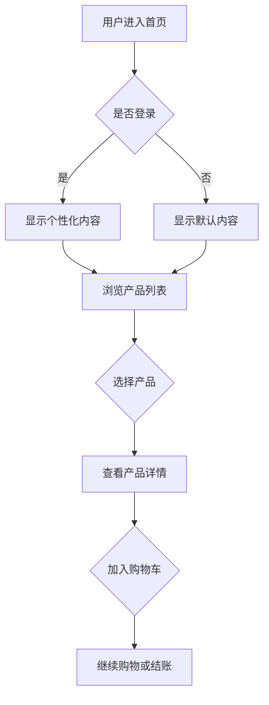
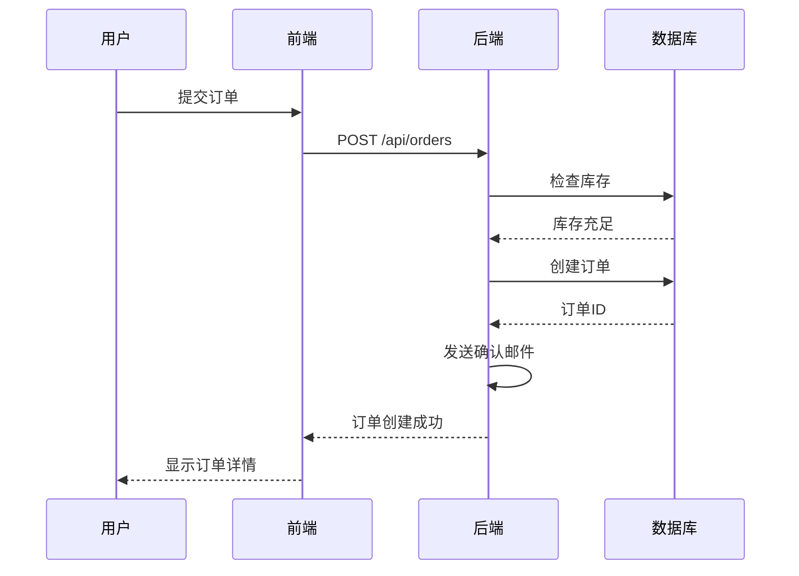
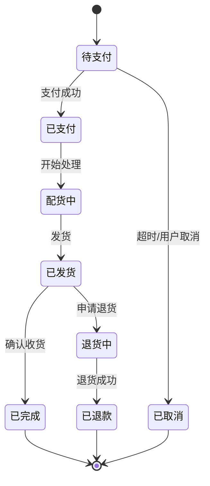
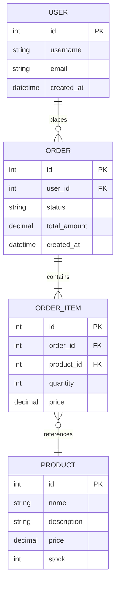
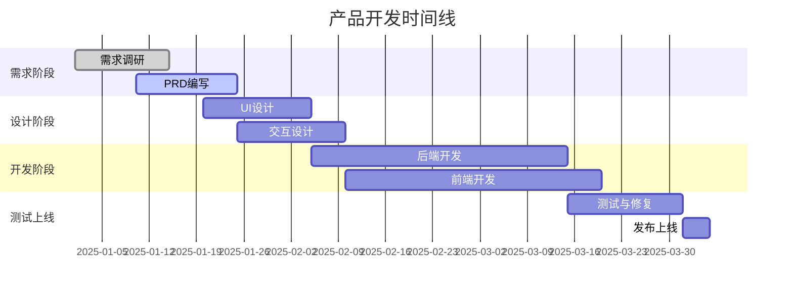

# PRD 写作技能

## 概述
本技能帮助你撰写清晰、结构化、专业的产品需求文档（PRD），并支持在文档中嵌入产品原型图和界面设计草图。

## PRD 标准结构

### 1. 产品概述
- **产品名称和定位**：简洁描述产品是什么
- **产品愿景**：产品的长期目标和价值主张
- **目标用户**：明确的用户画像和使用场景
- **核心问题**：产品要解决的主要痛点

### 2. 市场分析
- **市场机会**：市场规模、增长趋势、市场空白
- **竞品分析**：主要竞争对手及其优劣势
- **差异化优势**：我们的独特价值和竞争壁垒
- **商业模式**：如何创造和获取价值

### 3. 用户研究
- **用户画像**：详细的用户特征、需求、行为模式
- **用户旅程**：用户从发现到使用的完整路径
- **用户故事**：以"作为[角色]，我想要[功能]，以便[价值]"的格式描述
- **痛点分析**：当前解决方案的不足之处

### 4. 功能规划
- **核心功能清单**：MVP必需的关键功能
- **功能优先级**：使用MoSCoW方法（Must/Should/Could/Won't）
- **功能详细说明**：每个功能的输入、处理、输出和边界条件
- **功能依赖关系**：功能之间的关联和依赖

### 5. 产品原型和界面设计
- **信息架构**：产品的页面结构和导航逻辑
- **界面原型图**：关键页面的视觉布局和交互流程
- **交互说明**：用户操作和系统响应
- **设计规范**：UI组件、颜色、字体、间距等

### 6. 技术要求
- **技术架构**：系统架构图和技术栈选择
- **性能要求**：响应时间、并发量、可用性等指标
- **安全要求**：数据安全、隐私保护、权限控制
- **集成需求**：第三方服务、API、数据对接

### 7. 成功指标
- **关键指标（KPI）**：可量化的成功标准
- **用户指标**：活跃用户、留存率、转化率等
- **业务指标**：收入、利润、市场份额等
- **产品指标**：功能使用率、用户满意度等

### 8. 项目规划
- **开发里程碑**：按阶段划分的交付目标
- **资源需求**：人力、预算、工具和设备
- **风险识别**：潜在风险及应对策略
- **发布计划**：Beta测试、灰度发布、全量上线

## 产品原型图绘制方法

### 方法1：使用Mermaid图表

#### 流程图（用户流程）


#### 序列图（交互流程）


#### 状态图（订单状态）


#### 实体关系图（数据模型）


#### 甘特图（项目时间线）


### 方法2：使用ASCII艺术绘制界面原型

#### 移动应用界面
```
┌─────────────────────────┐
│  ☰  MyApp      🔔  👤   │  <- 顶部导航栏
├─────────────────────────┤
│                         │
│   🔍 搜索产品...        │  <- 搜索框
│                         │
├─────────────────────────┤
│  分类导航                │
│  [电子] [服饰] [食品]   │  <- 分类标签
├─────────────────────────┤
│  ┌─────────┐ ┌─────────┐│
│  │ [图片]  │ │ [图片]  ││  <- 产品卡片
│  │ 产品A   │ │ 产品B   ││
│  │ ￥99    │ │ ￥149   ││
│  │ [购买]  │ │ [购买]  ││
│  └─────────┘ └─────────┘│
│  ┌─────────┐ ┌─────────┐│
│  │ [图片]  │ │ [图片]  ││
│  │ 产品C   │ │ 产品D   ││
│  │ ￥79    │ │ ￥199   ││
│  │ [购买]  │ │ [购买]  ││
│  └─────────┘ └─────────┘│
│                         │
├─────────────────────────┤
│ [首页] [分类] [购物车] [我]│ <- 底部标签栏
└─────────────────────────┘
```

#### Web应用界面
```
╔═══════════════════════════════════════════════════════════╗
║  Logo    [首页] [产品] [关于] [联系]        [登录] [注册] ║  <- 顶部导航
╠═══════════════════════════════════════════════════════════╣
║                                                           ║
║   ┌───────────────────────────────────────────────────┐  ║
║   │                                                   │  ║
║   │          欢迎使用我们的产品                        │  ║
║   │          [立即开始] [了解更多]                     │  ║  <- Hero区域
║   │                                                   │  ║
║   └───────────────────────────────────────────────────┘  ║
║                                                           ║
║   ┌─────────────┐  ┌─────────────┐  ┌─────────────┐    ║
║   │   图标1     │  │   图标2     │  │   图标3     │    ║
║   │   特性1     │  │   特性2     │  │   特性3     │    ║  <- 特性展示
║   │   描述...   │  │   描述...   │  │   描述...   │    ║
║   └─────────────┘  └─────────────┘  └─────────────┘    ║
║                                                           ║
╠═══════════════════════════════════════════════════════════╣
║  关于我们 | 隐私政策 | 服务条款 | 联系方式                 ║  <- 页脚
╚═══════════════════════════════════════════════════════════╝
```

#### 表单设计
```
┌─────────────────────────────────┐
│  用户注册                       │
├─────────────────────────────────┤
│                                 │
│  用户名  [________________]     │
│  * 必填，3-20个字符             │
│                                 │
│  邮箱    [________________]     │
│  * 必填，有效的邮箱地址         │
│                                 │
│  密码    [________________]     │
│  * 必填，至少8个字符            │
│                                 │
│  确认密码[________________]     │
│                                 │
│  [ ] 我同意服务条款和隐私政策   │
│                                 │
│  [     注册     ] [  取消  ]    │
│                                 │
└─────────────────────────────────┘
```

### 方法3：详细的界面描述

当无法绘制图形时，使用结构化的文字描述：

#### 界面描述模板
```
**页面名称：** 产品详情页

**布局：**
- 顶部：固定导航栏（高度60px）
  - 左侧：返回按钮
  - 中间：页面标题
  - 右侧：分享按钮、收藏按钮

- 内容区域：可滚动
  - 产品图片轮播（高度400px）
    - 支持左右滑动
    - 底部显示图片指示器（小圆点）

  - 产品信息卡片
    - 产品名称（大字号，加粗）
    - 产品价格（红色，突出显示）
    - 销量和评分（星级+数字）
    - 配送信息（图标+文字）

  - 规格选择区域
    - 颜色选择（色块按钮，可多选）
    - 尺寸选择（圆形按钮，单选）
    - 数量选择（减号、数字、加号）

  - 产品详情标签页
    - Tab1：产品介绍（富文本）
    - Tab2：规格参数（表格）
    - Tab3：用户评价（列表）

- 底部：固定操作栏（高度60px）
  - 左侧：客服按钮、购物车按钮（带数量徽章）
  - 右侧：加入购物车按钮（次要样式）、立即购买按钮（主要样式）

**交互说明：**
- 点击图片放大查看
- 点击规格后，价格动态更新
- 加入购物车有弹窗确认动画
- 下拉刷新可重新加载数据
```

## PRD 写作最佳实践

### 1. 清晰性原则
- 使用简洁明了的语言，避免歧义
- 每个需求都应该有明确的定义
- 使用"必须"、"应该"、"可以"来表示优先级

### 2. 完整性原则
- 涵盖产品的所有关键方面
- 包含正常流程和异常情况的处理
- 提供足够的上下文信息

### 3. 可验证性原则
- 每个需求都应该可以测试和验证
- 提供明确的验收标准
- 使用量化指标而非模糊描述

### 4. 可追溯性原则
- 需求与业务目标对应
- 功能与用户故事关联
- 保持版本历史和变更记录

### 5. 视觉化原则
- 使用图表、原型图增强理解
- 复杂流程用流程图表示
- 数据关系用ER图展现
- 界面用线框图或高保真原型

## 使用指南

### 创建新PRD
1. 收集产品背景信息和业务目标
2. 进行用户研究和市场分析
3. 按照标准结构组织内容
4. 绘制关键的原型图和流程图
5. 与团队评审并迭代完善

### 完善现有PRD
1. 识别PRD中的缺失或不清晰部分
2. 补充详细的功能说明和原型图
3. 更新市场分析和竞品信息
4. 调整优先级和时间规划

### 选择合适的原型图类型
- **用户流程** → 使用流程图（Mermaid graph）
- **系统交互** → 使用序列图（Mermaid sequence）
- **状态变化** → 使用状态图（Mermaid state）
- **数据模型** → 使用ER图（Mermaid erDiagram）
- **项目规划** → 使用甘特图（Mermaid gantt）
- **界面布局** → 使用ASCII艺术或详细描述

## 输出格式

PRD文档应使用Markdown格式，包含：
- 标题和目录
- 清晰的章节划分
- Mermaid代码块（会渲染为图表）
- ASCII艺术（会保持等宽字体显示）
- 表格、列表、引用等丰富格式
- 必要的链接和参考资料

## 注意事项

- PRD应该面向多个角色：产品经理、设计师、工程师、测试、运营
- 原型图应该清晰表达设计意图，但不需要过度细节
- 保持文档的可维护性，定期更新和版本控制
- 在git仓库中保存PRD，方便协作和追溯历史
- 使用清晰的文件命名：如 `PRD_ProductName_v1.0.md`

## 资源文件

在 `references/` 目录中提供了：
- `prd-template.md`：完整的PRD模板
- `prototype-examples.md`：各种原型图示例
- `user-story-template.md`：用户故事模板

在 `assets/` 目录中提供了：
- `prd-checklist.json`：PRD完整性检查清单
