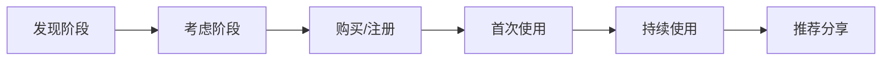
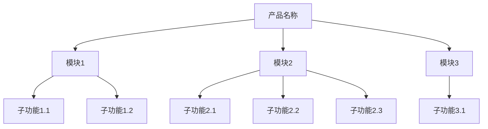
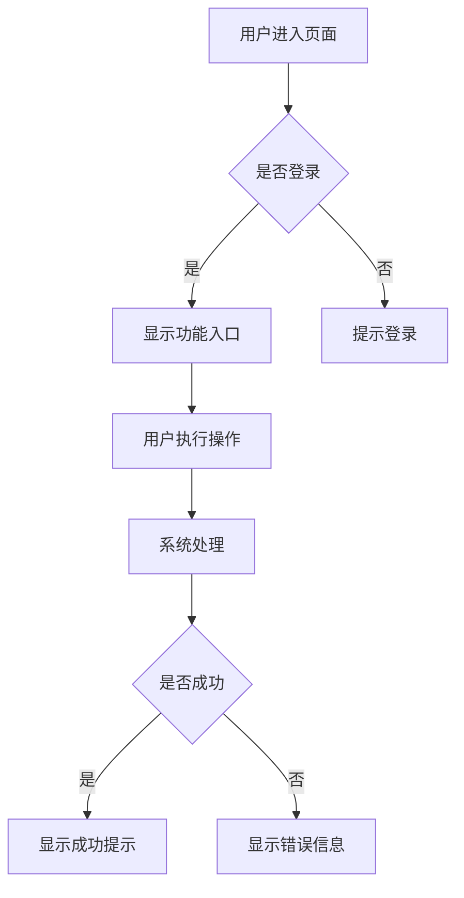
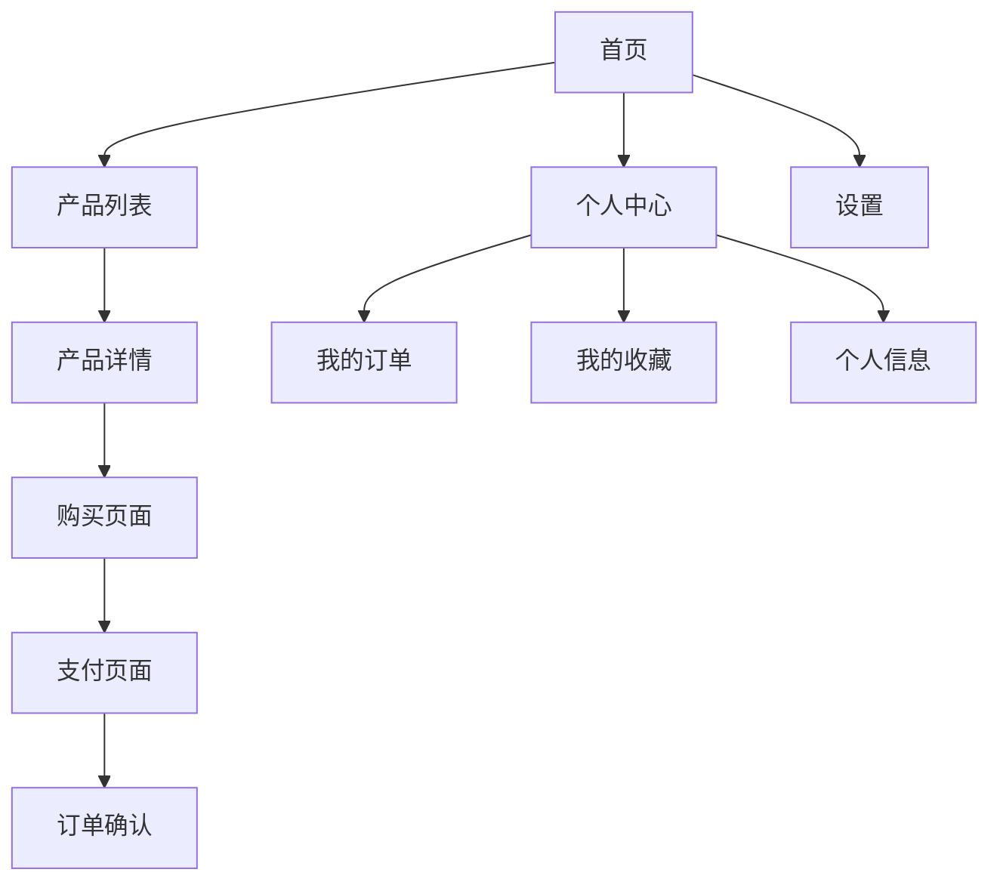
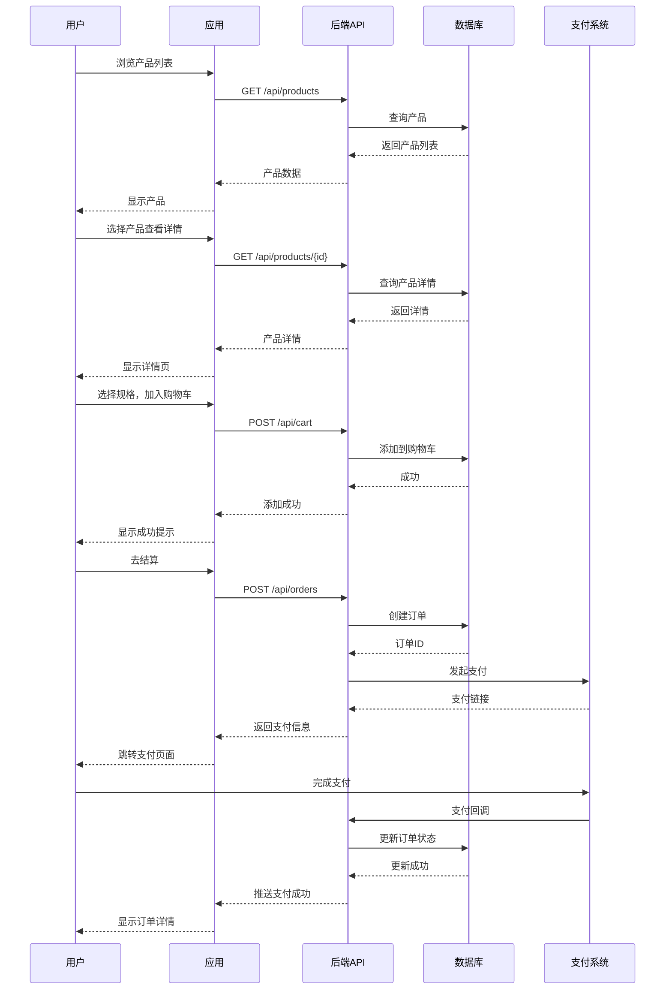
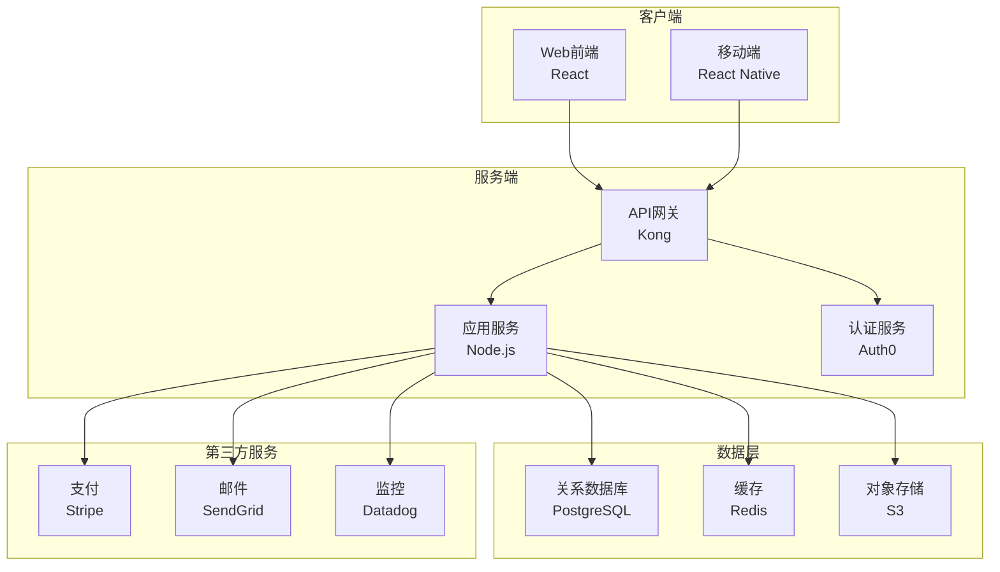
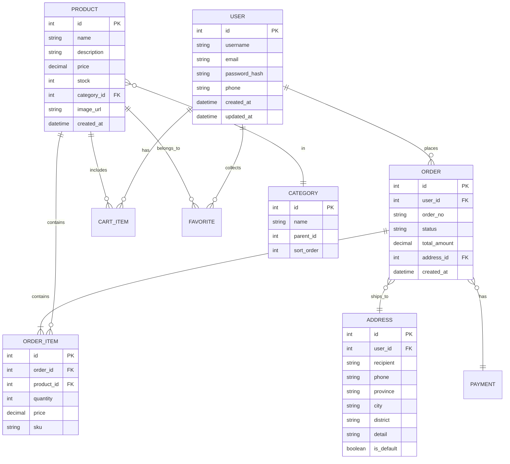
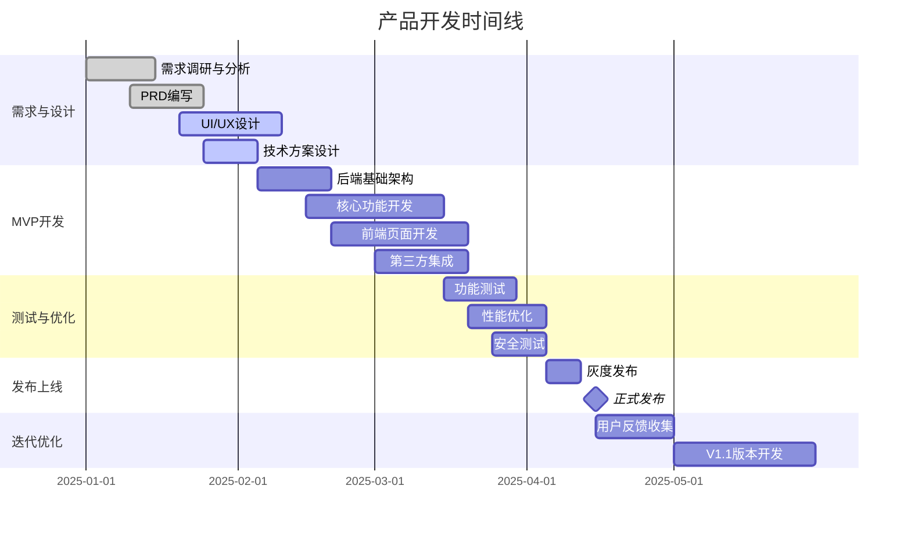

# 产品需求文档（PRD）

**产品名称：** [产品名称]
**版本：** v1.0
**文档作者：** [作者名称]
**创建日期：** [日期]
**最后更新：** [日期]
**文档状态：** [草稿 / 评审中 / 已批准]

---

## 目录
1. [产品概述](#1-产品概述)
2. [市场分析](#2-市场分析)
3. [用户研究](#3-用户研究)
4. [功能规划](#4-功能规划)
5. [产品原型](#5-产品原型)
6. [技术要求](#6-技术要求)
7. [成功指标](#7-成功指标)
8. [项目规划](#8-项目规划)
9. [附录](#9-附录)

---

## 1. 产品概述

### 1.1 产品定位
[简洁描述产品是什么，一句话说明产品价值]

### 1.2 产品愿景
[描述产品的长期目标和期望达成的影响]

### 1.3 目标用户
- **主要用户群体：** [用户类型1]
- **次要用户群体：** [用户类型2]
- **用户规模：** [预计用户量]

### 1.4 核心问题
[列出产品要解决的3-5个主要用户痛点]
1. 痛点1
2. 痛点2
3. 痛点3

### 1.5 价值主张
[说明产品如何解决这些痛点，为用户创造什么价值]

---

## 2. 市场分析

### 2.1 市场机会
- **市场规模：** [TAM, SAM, SOM]
- **市场增长：** [年增长率]
- **市场趋势：** [关键趋势]

### 2.2 竞品分析

| 竞品 | 优势 | 劣势 | 市场份额 |
|------|------|------|----------|
| 竞品A | ... | ... | ... |
| 竞品B | ... | ... | ... |
| 竞品C | ... | ... | ... |

### 2.3 差异化优势
[说明我们与竞品的核心差异]
1. 差异点1
2. 差异点2
3. 差异点3

### 2.4 商业模式
- **收入来源：** [如何赚钱]
- **成本结构：** [主要成本]
- **定价策略：** [价格定位]

---

## 3. 用户研究

### 3.1 用户画像

#### 用户画像1：[角色名称]
- **人口统计：** 年龄、性别、地域、收入
- **行为特征：** 使用习惯、偏好、活跃时间
- **目标需求：** 想要达成什么目标
- **痛点困扰：** 当前遇到的问题

#### 用户画像2：[角色名称]
[同上]

### 3.2 用户旅程地图



**各阶段描述：**
- **发现阶段：** [用户如何知道产品]
- **考虑阶段：** [用户如何评估产品]
- **购买/注册：** [用户转化的关键因素]
- **首次使用：** [用户的Onboarding体验]
- **持续使用：** [用户的留存驱动力]
- **推荐分享：** [用户为何推荐]

### 3.3 用户故事

#### Epic 1：[功能领域]
- **US-001：** 作为 [用户角色]，我想要 [功能/能力]，以便 [获得的价值/解决的问题]
  - **优先级：** P0 (Must Have)
  - **验收标准：**
    - [ ] 标准1
    - [ ] 标准2
    - [ ] 标准3

- **US-002：** 作为...
  - **优先级：** P1 (Should Have)
  - **验收标准：**
    - [ ] ...

#### Epic 2：[功能领域]
[同上]

---

## 4. 功能规划

### 4.1 功能架构图



### 4.2 功能清单及优先级

| 功能ID | 功能名称 | 优先级 | 说明 | 依赖 |
|--------|---------|--------|------|------|
| F-001 | [功能名] | P0 | [简述] | - |
| F-002 | [功能名] | P0 | [简述] | F-001 |
| F-003 | [功能名] | P1 | [简述] | - |
| F-004 | [功能名] | P2 | [简述] | F-003 |

**优先级定义：**
- **P0 (Must Have)：** MVP必需功能，缺少会导致产品无法使用
- **P1 (Should Have)：** 重要功能，显著提升用户体验
- **P2 (Could Have)：** 锦上添花的功能
- **P3 (Won't Have)：** 本版本不做，未来考虑

### 4.3 详细功能规格

#### 功能F-001：[功能名称]

**功能描述：**
[详细描述功能的作用和行为]

**用户操作流程：**


**输入参数：**
- 参数1：[名称、类型、必填性、说明]
- 参数2：[同上]

**输出结果：**
- 成功：[返回什么]
- 失败：[错误码和错误信息]

**业务规则：**
1. 规则1
2. 规则2
3. 规则3

**边界条件：**
- 最大值/最小值
- 异常情况处理
- 性能要求

**验收标准：**
- [ ] 标准1
- [ ] 标准2
- [ ] 标准3

---

## 5. 产品原型

### 5.1 信息架构



### 5.2 关键页面原型

#### 5.2.1 首页设计

```
┌─────────────────────────────────────────────┐
│  ☰  Logo          🔍 搜索       🔔  👤     │  <- 导航栏
├─────────────────────────────────────────────┤
│                                             │
│  ┌───────────────────────────────────────┐ │
│  │                                       │ │
│  │         轮播图/Banner                 │ │  <- Hero区域
│  │         ○ ○ ●                         │ │
│  └───────────────────────────────────────┘ │
│                                             │
│  热门分类                          [更多 >] │
│  ┌──────┐ ┌──────┐ ┌──────┐ ┌──────┐     │
│  │ 图标 │ │ 图标 │ │ 图标 │ │ 图标 │     │  <- 分类图标
│  │分类1 │ │分类2 │ │分类3 │ │分类4 │     │
│  └──────┘ └──────┘ └──────┘ └──────┘     │
│                                             │
│  精选推荐                          [更多 >] │
│  ┌─────────────┐  ┌─────────────┐         │
│  │   [图片]    │  │   [图片]    │         │
│  │  产品名称   │  │  产品名称   │         │  <- 产品卡片
│  │  ￥99.00    │  │  ￥149.00   │         │
│  │  ⭐⭐⭐⭐⭐   │  │  ⭐⭐⭐⭐⭐   │         │
│  │  [立即购买] │  │  [立即购买] │         │
│  └─────────────┘  └─────────────┘         │
│                                             │
├─────────────────────────────────────────────┤
│   [首页]    [分类]    [购物车]    [我的]   │  <- 底部导航
└─────────────────────────────────────────────┘
```

**交互说明：**
- 轮播图自动播放，支持手动滑动
- 点击分类图标进入对应分类页面
- 产品卡片支持添加收藏和快速购买
- 下拉刷新更新推荐内容

#### 5.2.2 产品详情页

```
┌─────────────────────────────────────────────┐
│  ← 返回          产品详情        ⋮  ♥      │
├─────────────────────────────────────────────┤
│                                             │
│  ┌───────────────────────────────────────┐ │
│  │                                       │ │
│  │         产品主图                      │ │
│  │         1/5                           │ │  <- 图片轮播
│  └───────────────────────────────────────┘ │
│                                             │
│  产品名称 - 详细的产品标题                  │
│  ￥149.00            原价：￥199.00         │
│  ⭐⭐⭐⭐⭐ 4.8分 (1234条评价)              │
│                                             │
│  ┌─────────────────────────────────────┐   │
│  │ 配送：预计2-3天送达                 │   │
│  │ 服务：7天无理由退换                 │   │  <- 服务信息
│  └─────────────────────────────────────┘   │
│                                             │
│  选择规格                              [>] │
│  颜色：⬜ 白色  ⬛ 黑色  🔴 红色           │
│  尺寸：○ S   ○ M   ● L   ○ XL            │
│  数量：[-]  1  [+]                         │
│                                             │
│  ┌─[产品介绍]─[规格参数]─[用户评价]─┐     │
│  │                                   │     │
│  │  这里是产品的详细介绍内容...       │     │  <- 标签页内容
│  │                                   │     │
│  └───────────────────────────────────┘     │
│                                             │
├─────────────────────────────────────────────┤
│  [💬客服] [🛒购物车]  [加入购物车] [立即购买] │  <- 底部操作栏
└─────────────────────────────────────────────┘
```

**交互说明：**
- 图片支持放大查看
- 选择规格后价格和库存实时更新
- 加入购物车显示动画效果
- 立即购买跳转到结算页面

#### 5.2.3 用户流程图



### 5.3 交互设计规范

**交互原则：**
- 简单直观，符合用户习惯
- 及时反馈，每个操作都有响应
- 容错友好，可撤销操作
- 一致性，相同操作行为一致

**常用交互模式：**
- 下拉刷新：更新数据
- 上拉加载：加载更多
- 滑动删除：删除列表项
- 长按：显示操作菜单
- 双击：快速操作（如点赞）

---

## 6. 技术要求

### 6.1 技术架构



### 6.2 技术栈

**前端：**
- 框架：React 18+ / Vue 3+
- 状态管理：Redux / Pinia
- UI组件库：Ant Design / Element Plus
- 构建工具：Vite / Webpack

**后端：**
- 语言：Node.js / Python / Java
- 框架：Express / FastAPI / Spring Boot
- API协议：RESTful / GraphQL
- 文档：Swagger / OpenAPI

**数据库：**
- 主库：PostgreSQL / MySQL
- 缓存：Redis
- 搜索：Elasticsearch
- 消息队列：RabbitMQ / Kafka

**基础设施：**
- 容器：Docker
- 编排：Kubernetes
- CI/CD：GitHub Actions
- 云平台：AWS / Azure / GCP

### 6.3 性能要求

| 指标 | 目标 | 说明 |
|------|------|------|
| 页面加载时间 | < 2秒 | 首屏渲染完成时间 |
| API响应时间 | < 200ms | P99响应时间 |
| 系统可用性 | 99.9% | 月度可用性 |
| 并发用户数 | 10,000 | 支持的同时在线用户 |
| 数据库QPS | 5,000 | 每秒查询数 |

### 6.4 安全要求

- **身份认证：** OAuth 2.0 / JWT
- **数据加密：** HTTPS / TLS 1.3
- **数据存储：** 敏感数据加密存储
- **权限控制：** RBAC基于角色的访问控制
- **安全审计：** 操作日志记录和审计
- **漏洞防护：** 定期安全扫描，修复OWASP Top 10漏洞

### 6.5 数据模型



### 6.6 集成需求

| 集成服务 | 用途 | API文档 |
|----------|------|---------|
| 支付宝 | 在线支付 | [链接] |
| 微信支付 | 在线支付 | [链接] |
| 物流API | 物流查询 | [链接] |
| 短信服务 | 验证码发送 | [链接] |
| 地图API | 地址定位 | [链接] |

---

## 7. 成功指标

### 7.1 关键绩效指标（KPI）

#### 用户增长指标
- **新用户注册数：** 目标每月增长20%
- **日活跃用户（DAU）：** 目标10,000+
- **月活跃用户（MAU）：** 目标50,000+
- **用户留存率：**
  - 次日留存：> 40%
  - 7日留存：> 25%
  - 30日留存：> 15%

#### 业务转化指标
- **转化率：** 访问到注册 > 5%，注册到首购 > 20%
- **客单价：** 平均订单金额 > ￥150
- **复购率：** 30天复购率 > 30%
- **GMV：** 月交易额目标￥500万

#### 产品使用指标
- **平均会话时长：** > 5分钟
- **页面浏览深度：** > 3页/会话
- **功能使用率：** 核心功能使用率 > 60%
- **用户满意度：** NPS得分 > 50

#### 技术性能指标
- **页面加载速度：** < 2秒
- **API成功率：** > 99.5%
- **错误率：** < 0.5%
- **系统可用性：** > 99.9%

### 7.2 北极星指标

**核心指标：** 月活跃交易用户数（有购买行为的MAU）

**定义：** 在过去30天内完成至少一次交易的独立用户数

**目标：** 首季度达到10,000人，每季度增长50%

**追踪方式：**
- 实时监控大盘
- 每日/周/月报表
- 按用户来源、设备、地域等维度拆解分析

### 7.3 A/B测试计划

| 测试项目 | 假设 | 指标 | 时间 |
|----------|------|------|------|
| 首页布局优化 | 新布局提升点击率 | CTR | 2周 |
| 结算流程简化 | 简化流程提升转化 | 转化率 | 2周 |
| 推荐算法调整 | 新算法提升GMV | GMV | 4周 |

---

## 8. 项目规划

### 8.1 开发里程碑



### 8.2 版本规划

#### V1.0 MVP（2025年4月）
- ✅ 用户注册和登录
- ✅ 产品浏览和搜索
- ✅ 购物车和下单
- ✅ 在线支付
- ✅ 订单管理

#### V1.1 功能增强（2025年5月）
- ⏳ 用户评价和晒单
- ⏳ 收藏和浏览历史
- ⏳ 优惠券系统
- ⏳ 推荐算法优化

#### V1.2 生态扩展（2025年6月）
- ⏳ 社交分享
- ⏳ 会员体系
- ⏳ 积分系统
- ⏳ 第三方卖家入驻

### 8.3 资源需求

**人力资源：**
- 产品经理：1人
- UI/UX设计师：1人
- 前端工程师：2人
- 后端工程师：2人
- 测试工程师：1人
- 运维工程师：1人

**预算：**
- 人力成本：约￥100万/年
- 云服务成本：约￥20万/年
- 第三方服务：约￥10万/年
- 营销推广：约￥50万/年
- **总预算：** 约￥180万/年

### 8.4 风险管理

| 风险类型 | 风险描述 | 影响程度 | 应对策略 |
|----------|----------|----------|----------|
| 技术风险 | 第三方服务不稳定 | 高 | 准备备用方案，多服务商 |
| 市场风险 | 竞品抢占市场 | 中 | 快速迭代，差异化竞争 |
| 资源风险 | 开发人员离职 | 中 | 知识文档化，备份人员 |
| 合规风险 | 政策法规变化 | 低 | 持续关注，及时调整 |
| 安全风险 | 数据泄露 | 高 | 安全审计，加密存储 |

---

## 9. 附录

### 9.1 术语表

| 术语 | 定义 |
|------|------|
| MVP | 最小可行产品（Minimum Viable Product） |
| DAU | 日活跃用户（Daily Active Users） |
| MAU | 月活跃用户（Monthly Active Users） |
| GMV | 商品交易总额（Gross Merchandise Volume） |
| NPS | 净推荐值（Net Promoter Score） |

### 9.2 参考资料

- [市场调研报告]
- [竞品分析文档]
- [用户访谈记录]
- [设计规范文档]
- [技术选型文档]

### 9.3 变更历史

| 版本 | 日期 | 修改内容 | 修改人 |
|------|------|----------|--------|
| v1.0 | 2025-01-25 | 初始版本 | [作者] |
| v1.1 | 2025-02-10 | 更新功能规格 | [作者] |

---

**文档结束**
