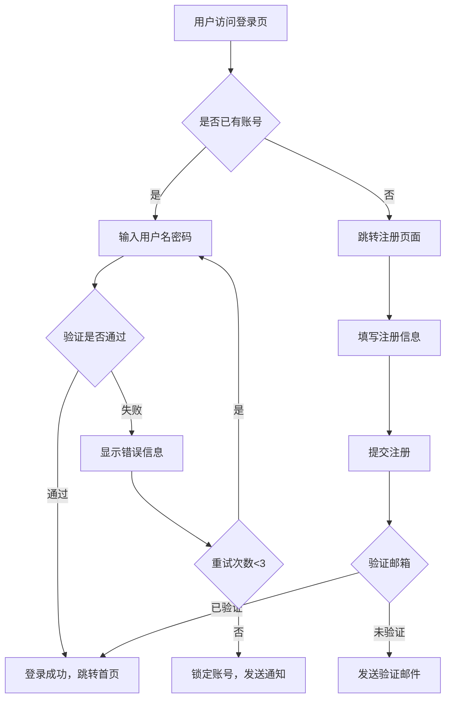
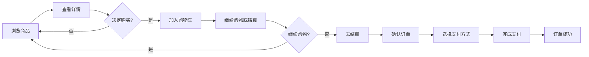
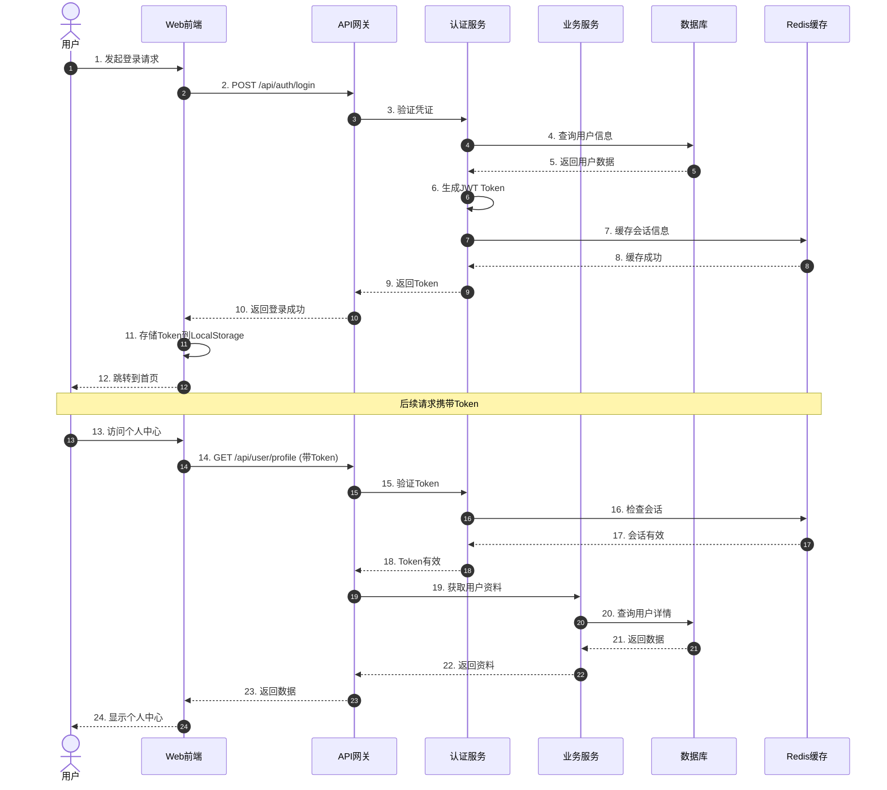
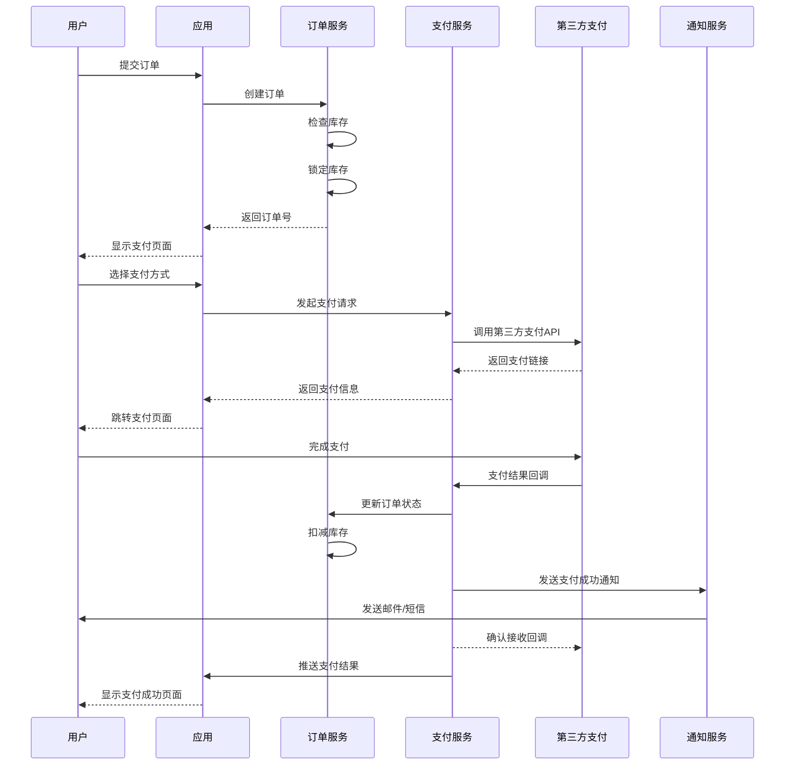
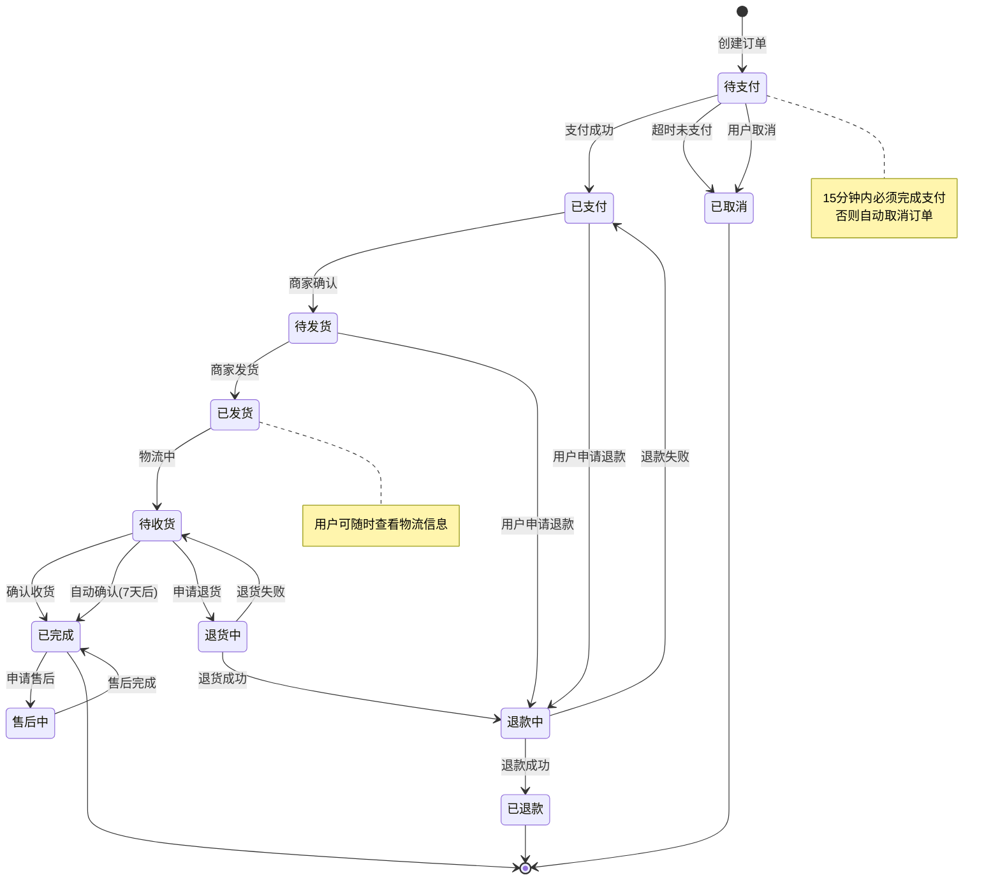
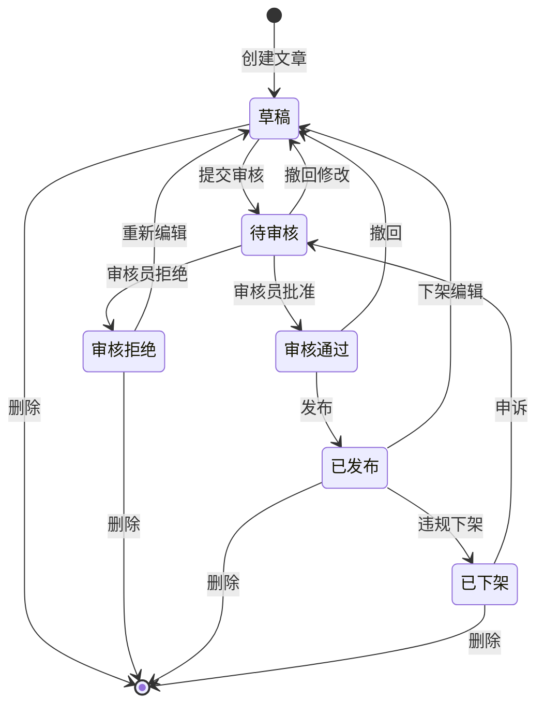
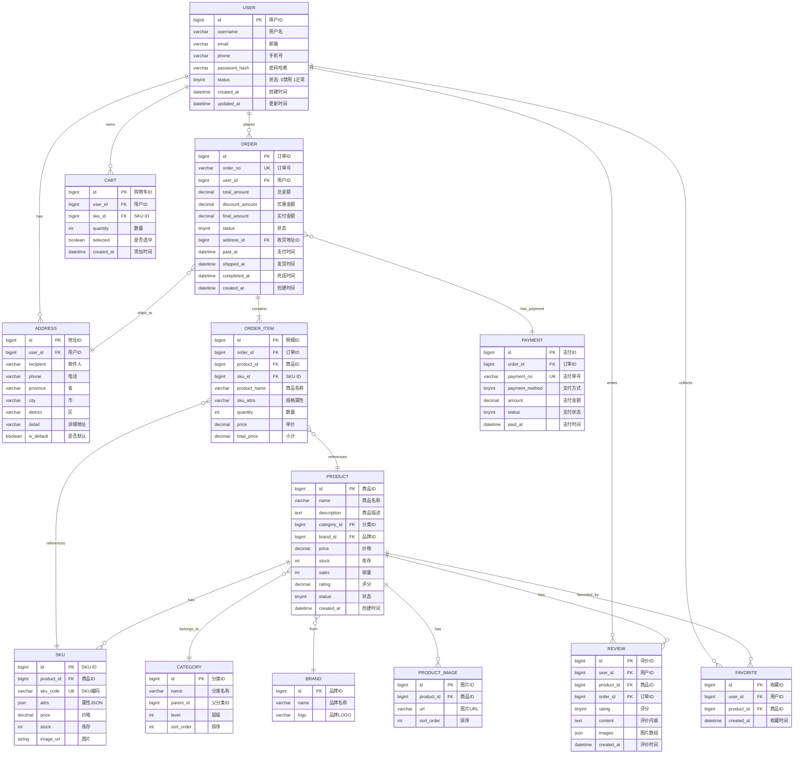
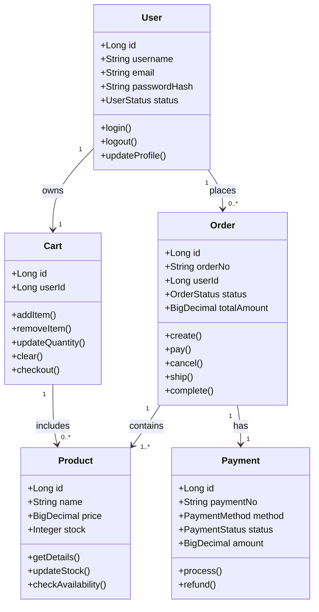
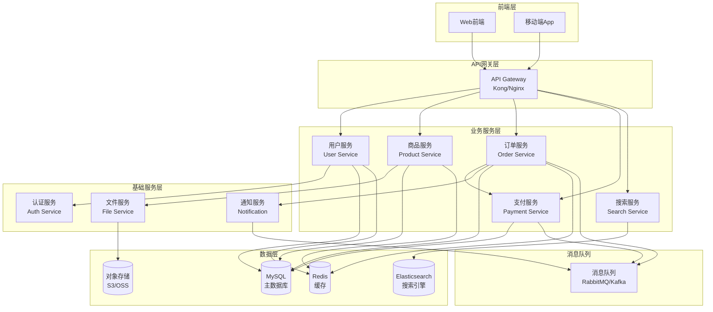
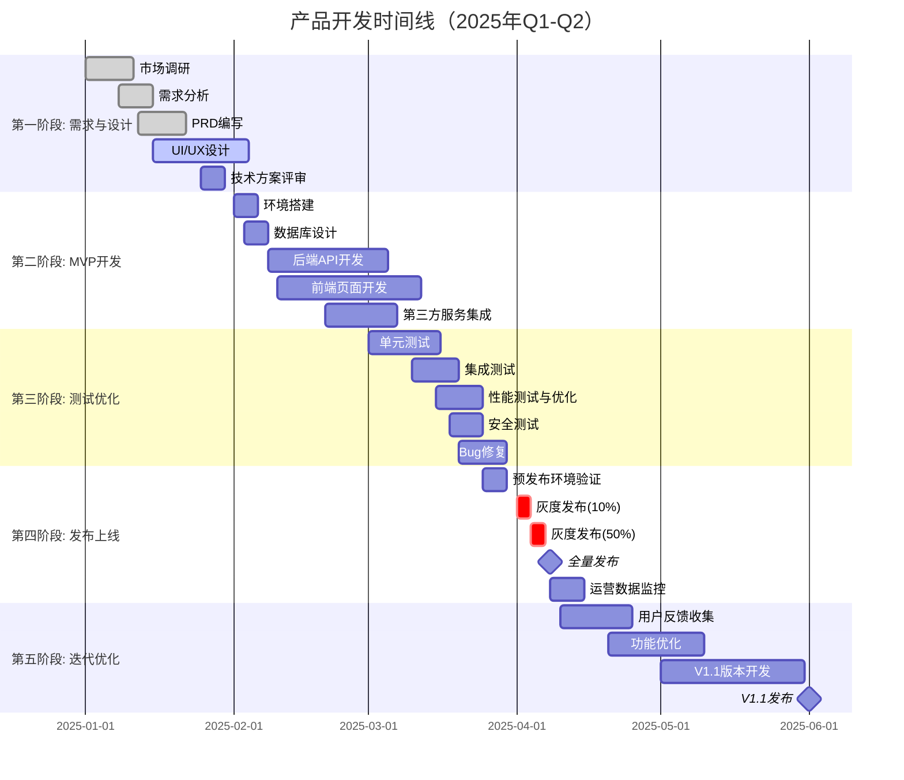

# 产品原型图示例集

本文档提供了多种原型图绘制方法和示例，帮助你在PRD中清晰地表达产品设计。

---

## 目录
1. [Mermaid图表示例](#mermaid图表示例)
2. [ASCII艺术界面](#ascii艺术界面)
3. [详细界面描述模板](#详细界面描述模板)

---

## Mermaid图表示例

### 1. 用户流程图（Flowchart）

#### 登录流程


#### 购物流程


### 2. 序列图（Sequence Diagram）

#### API交互流程


#### 支付流程


### 3. 状态图（State Diagram）

#### 订单状态机


#### 文章审核状态


### 4. 实体关系图（ER Diagram）

#### 电商系统数据模型


### 5. 类图（Class Diagram）

#### 系统架构类图


### 6. 组件图（Component Diagram）

#### 微服务架构


### 7. 时间线图（Gantt Chart）

#### 项目开发计划


---

## ASCII艺术界面

### 移动端界面示例

#### 1. 登录页面
```
┌─────────────────────────────┐
│                             │
│         📱 MyApp            │
│                             │
│   ┌─────────────────────┐   │
│   │                     │   │
│   │      [Logo图]       │   │
│   │                     │   │
│   └─────────────────────┘   │
│                             │
│   欢迎回来                   │
│                             │
│   ┌─────────────────────┐   │
│   │ 📧 邮箱/手机号       │   │
│   └─────────────────────┘   │
│                             │
│   ┌─────────────────────┐   │
│   │ 🔒 密码              │   │
│   └─────────────────────┘   │
│                             │
│   忘记密码？                 │
│                             │
│   ┌─────────────────────┐   │
│   │      登 录          │   │
│   └─────────────────────┘   │
│                             │
│   ──────── 或 ────────      │
│                             │
│   [微信登录] [支付宝登录]    │
│                             │
│   还没有账号？ 立即注册      │
│                             │
└─────────────────────────────┘
```

#### 2. 首页
```
┌─────────────────────────────────┐
│  ☰ MyApp    🔍搜索    🔔 👤    │  ← 顶部导航
├─────────────────────────────────┤
│                                 │
│  ┏━━━━━━━━━━━━━━━━━━━━━━━━━┓   │
│  ┃                         ┃   │
│  ┃    轮播Banner 1/3       ┃   │  ← 轮播图
│  ┃         ● ○ ○           ┃   │
│  ┗━━━━━━━━━━━━━━━━━━━━━━━━━┛   │
│                                 │
│  🎯 快捷入口                     │
│  ┌────┐ ┌────┐ ┌────┐ ┌────┐  │
│  │ 🛒 │ │ 📦 │ │ 💰 │ │ ⭐ │  │
│  │秒杀│ │新品│ │优惠│ │精选│  │  ← 分类入口
│  └────┘ └────┘ └────┘ └────┘  │
│                                 │
│  📌 精选推荐            更多 ＞ │
│  ╔═══════════╗  ╔═══════════╗  │
│  ║   图片    ║  ║   图片    ║  │
│  ║           ║  ║           ║  │
│  ╠═══════════╣  ╠═══════════╣  │
│  ║ 商品标题  ║  ║ 商品标题  ║  │  ← 商品卡片
│  ║ ￥99.00   ║  ║ ￥149.00  ║  │
│  ║ ⭐⭐⭐⭐⭐ ║  ║ ⭐⭐⭐⭐   ║  │
│  ║ [购买]    ║  ║ [购买]    ║  │
│  ╚═══════════╝  ╚═══════════╝  │
│                                 │
│  ╔═══════════╗  ╔═══════════╗  │
│  ║   图片    ║  ║   图片    ║  │
│  ║           ║  ║           ║  │
│  ╠═══════════╣  ╠═══════════╣  │
│  ║ 商品标题  ║  ║ 商品标题  ║  │
│  ║ ￥79.00   ║  ║ ￥199.00  ║  │
│  ║ ⭐⭐⭐⭐⭐ ║  ║ ⭐⭐⭐⭐⭐ ║  │
│  ║ [购买]    ║  ║ [购买]    ║  │
│  ╚═══════════╝  ╚═══════════╝  │
│                                 │
│  ⬇ 下拉加载更多...              │
│                                 │
├─────────────────────────────────┤
│ [🏠首页][📂分类][🛒购物车][👤我] │  ← 底部Tab
└─────────────────────────────────┘
```

#### 3. 商品详情页
```
┌─────────────────────────────────┐
│  ← 返回    商品详情    ⋮  ♥     │  ← 顶部操作栏
├─────────────────────────────────┤
│                                 │
│  ┏━━━━━━━━━━━━━━━━━━━━━━━━━┓   │
│  ┃                         ┃   │
│  ┃     商品主图 1/5        ┃   │  ← 图片轮播
│  ┃                         ┃   │
│  ┗━━━━━━━━━━━━━━━━━━━━━━━━━┛   │
│                                 │
│  超值热销商品 - 限时特惠        │
│  ￥149.00  ￥199.00  🔥25%OFF   │  ← 价格区
│  ⭐⭐⭐⭐⭐ 4.8 (1234评价)      │
│                                 │
│  ┌───────────────────────────┐ │
│  │ 🚚 配送: 预计2-3天送达    │ │
│  │ 🛡️ 服务: 7天无理由退换    │ │  ← 服务信息
│  │ ✅ 保障: 正品保证          │ │
│  └───────────────────────────┘ │
│                                 │
│  选择规格                   [＞]│
│  ┌───────────────────────────┐ │
│  │ 颜色: ⚪白色 ⚫黑色 🔴红色  │ │
│  │ 尺寸: ○S ○M ●L ○XL       │ │  ← 规格选择
│  │ 数量: [➖] 1 [➕]          │ │
│  └───────────────────────────┘ │
│                                 │
│  ┌─[产品介绍]─[规格]─[评价]─┐  │
│  │                           │  │
│  │  这款产品采用优质材料...  │  │
│  │  适合各种场景使用...      │  │  ← 详情Tab
│  │                           │  │
│  │  [查看完整介绍]           │  │
│  └───────────────────────────┘  │
│                                 │
│  猜你喜欢                       │
│  ╔══════╗ ╔══════╗ ╔══════╗   │
│  ║ 图片 ║ ║ 图片 ║ ║ 图片 ║   │  ← 推荐商品
│  ║￥99  ║ ║￥79  ║ ║￥129 ║   │
│  ╚══════╝ ╚══════╝ ╚══════╝   │
│                                 │
├─────────────────────────────────┤
│ [💬客服] [🛒2] [加入购物车] [立即购买] │  ← 底部操作栏
└─────────────────────────────────┘
```

#### 4. 购物车页面
```
┌─────────────────────────────────┐
│  购物车 (3件商品)        清空    │  ← 标题栏
├─────────────────────────────────┤
│                                 │
│  店铺A                [✓] 全选  │
│  ┌───────────────────────────┐ │
│  │☑️ [图] 商品名称            │ │
│  │     黑色/L                │ │
│  │     ￥149 x 1             │ │  ← 商品项
│  │     [➖] 1 [➕]     [🗑️]  │ │
│  └───────────────────────────┘ │
│                                 │
│  ┌───────────────────────────┐ │
│  │☑️ [图] 商品名称            │ │
│  │     白色/M                │ │
│  │     ￥99 x 2              │ │
│  │     [➖] 2 [➕]     [🗑️]  │ │
│  └───────────────────────────┘ │
│                                 │
│  店铺B                          │
│  ┌───────────────────────────┐ │
│  │☐  [图] 商品名称            │ │
│  │     已失效 [删除]          │ │  ← 失效商品
│  └───────────────────────────┘ │
│                                 │
│  为你推荐                       │
│  ┌────┐ ┌────┐ ┌────┐         │
│  │图片│ │图片│ │图片│         │  ← 推荐商品
│  │￥99│ │￥79│ │￥129│        │
│  └────┘ └────┘ └────┘         │
│                                 │
│                                 │
│                                 │
│                                 │
├─────────────────────────────────┤
│ ☑️全选  合计: ￥347.00           │
│           优惠: -￥20.00         │  ← 结算信息
│         实付: ￥327.00 [去结算(2)]│
└─────────────────────────────────┘
```

### Web端界面示例

#### 5. Dashboard后台
```
╔═════════════════════════════════════════════════════════════════╗
║  📊 DashBoard                          👤 Admin    🔔 ⚙️ 🚪  ║  ← 顶部导航
╠═══════╦═════════════════════════════════════════════════════════╣
║       ║                                                         ║
║  📂   ║  概览数据                                               ║
║ 首页  ║  ┌─────────────┐ ┌─────────────┐ ┌─────────────┐      ║
║       ║  │  今日订单   │ │  今日销售额 │ │  活跃用户   │      ║
║  📊   ║  │             │ │             │ │             │      ║
║ 统计  ║  │    1,234    │ │  ￥56,789  │ │    8,901    │      ║  ← 主内容区
║       ║  │  ↑ 12.5%    │ │  ↑ 8.3%    │ │  ↓ 2.1%    │      ║
║  🛍️   ║  └─────────────┘ └─────────────┘ └─────────────┘      ║
║ 订单  ║                                                         ║
║       ║  ┌─────────────┐ ┌─────────────┐ ┌─────────────┐      ║
║  📦   ║  │  待处理订单 │ │  库存预警   │ │  退款申请   │      ║
║ 商品  ║  │      23     │ │      5      │ │      3      │      ║
║       ║  └─────────────┘ └─────────────┘ └─────────────┘      ║
║  👥   ║                                                         ║
║ 用户  ║  销售趋势                            [日] [周] [月]     ║
║       ║  ┌───────────────────────────────────────────────┐    ║
║  💬   ║  │ 销售额                                        │    ║
║ 客服  ║  │ 60K├─────┐                                    │    ║
║       ║  │    │     │        ┌────┐                      │    ║
║  ⚙️   ║  │ 40K├     └─┐  ┌──┘    └──┐                  │    ║  ← 图表区域
║ 设置  ║  │    │       └──┘           └──┐               │    ║
║       ║  │ 20K├                          └────           │    ║
║       ║  │    │                                          │    ║
║       ║  │  0K└─┬────┬────┬────┬────┬────┬────┬────┬──  │    ║
║       ║  │      1    5   10   15   20   25   30        │    ║
║       ║  └───────────────────────────────────────────────┘    ║
║       ║                                                         ║
║       ║  最近订单                              [查看全部 >]    ║
║       ║  ┌─────┬──────────┬──────┬────────┬────────┬─────┐  ║
║       ║  │订单号│  商品    │ 数量 │  金额  │  状态  │操作 │  ║
║       ║  ├─────┼──────────┼──────┼────────┼────────┼─────┤  ║
║       ║  │10001│ 商品A    │  2   │ ￥298  │ 已发货 │详情 │  ║  ← 表格区域
║       ║  │10002│ 商品B    │  1   │ ￥149  │ 待发货 │处理 │  ║
║       ║  │10003│ 商品C    │  3   │ ￥447  │ 已完成 │详情 │  ║
║       ║  └─────┴──────────┴──────┴────────┴────────┴─────┘  ║
║       ║                                                         ║
╠═══════╩═════════════════════════════════════════════════════════╣
║  © 2025 MyCompany  |  v1.2.0  |  帮助文档  |  隐私政策        ║  ← 页脚
╚═════════════════════════════════════════════════════════════════╝
```

---

## 详细界面描述模板

### 界面描述示例：商品详情页

**页面名称：** 商品详情页（Product Detail Page）

**页面URL：** `/products/{product_id}`

**页面用途：** 展示商品的详细信息，帮助用户了解商品并做出购买决策

---

#### 布局结构

**1. 顶部导航栏（高度: 60px，固定定位）**
- **左侧：** 返回按钮（< 图标 + "返回"文字）
- **中间：** 页面标题"商品详情"（居中显示）
- **右侧：** 更多操作按钮（⋮）+ 收藏按钮（♥）

**2. 商品图片区（高度: 400px）**
- 主图轮播组件
  - 支持左右滑动切换图片
  - 底部显示图片指示器（小圆点，当前图片为实心）
  - 显示当前图片序号（如"1/5"）
  - 点击可放大查看
  - 支持双指缩放

**3. 商品基本信息卡片（白色背景，圆角，阴影）**
- **商品标题：**
  - 字体大小: 18px
  - 字重: 加粗
  - 颜色: #333
  - 最多显示2行，超出显示省略号

- **价格区域：**
  - 当前价格: ￥149.00（红色，24px，加粗）
  - 原价: ￥199.00（灰色，16px，删除线）
  - 折扣标签: "25% OFF"（红色背景，白色文字，圆角标签）

- **评分与销量：**
  - 星级评分: ⭐⭐⭐⭐⭐（5星，黄色）
  - 评分数值: 4.8分（灰色，14px）
  - 评价数量: (1234条评价)（灰色，14px，可点击）

**4. 服务信息区域（浅灰色背景）**
- 配送信息: 🚚 图标 + "预计2-3天送达"
- 服务承诺: 🛡️ 图标 + "7天无理由退换"
- 正品保障: ✅ 图标 + "正品保证"

**5. 规格选择区域（可展开/收起）**
- **标题栏：** "选择规格" + 右箭头
- **点击后展开：**
  - 颜色选择：
    - 圆形色块按钮（直径40px）
    - 已选中有边框高亮
    - 每个色块显示颜色名称

  - 尺寸选择：
    - 圆形按钮（直径50px）
    - 已选中有填充背景色
    - 显示尺码标签（S/M/L/XL）

  - 数量选择：
    - 减号按钮 + 数字输入框 + 加号按钮
    - 最小值为1
    - 最大值为库存数量
    - 数字居中显示

**6. 商品详情标签页**
- **Tab切换栏：**
  - Tab1: "产品介绍"
  - Tab2: "规格参数"
  - Tab3: "用户评价(1234)"
  - 当前Tab下方有下划线标识

- **Tab内容区域：**
  - **产品介绍：** 富文本内容，包含图文混排
  - **规格参数：** 表格形式展示（参数名 | 参数值）
  - **用户评价：** 列表展示，每条评价包含：
    - 用户头像 + 用户名
    - 评分星级
    - 评价内容
    - 评价图片（如有）
    - 评价时间
    - 点赞数

**7. 推荐商品区域（"猜你喜欢"）**
- 横向滚动的商品卡片列表
- 每个卡片显示：
  - 商品缩略图
  - 商品名称（1行）
  - 价格
- 无限滚动加载更多

**8. 底部操作栏（高度: 60px，固定定位）**
- **左侧：**
  - 客服按钮（💬 图标 + "客服"文字）
  - 购物车按钮（🛒 图标 + "购物车"文字）
    - 如有商品，显示数量徽章（红色圆点，白色数字）

- **右侧：**
  - "加入购物车"按钮（次要样式，浅色背景）
  - "立即购买"按钮（主要样式，主题色背景）
  - 按钮高度: 48px
  - 圆角: 24px

---

#### 交互行为

**1. 图片交互：**
- 左右滑动切换图片，有滑动动画
- 点击图片进入全屏查看模式
- 全屏模式支持双指缩放
- 全屏模式点击返回按钮或背景退出

**2. 规格选择：**
- 选择颜色/尺寸后，更新商品价格和库存信息
- 如果某规格缺货，显示为灰色不可选状态，并显示"缺货"标签
- 数量输入框只能输入正整数
- 点击减号至1时，减号变灰不可点击
- 点击加号至库存上限时，加号变灰不可点击，并提示"已达库存上限"

**3. 加入购物车：**
- 点击"加入购物车"按钮
- 显示商品图片从当前位置飞入购物车图标的动画
- 购物车数量徽章数字+1
- 底部弹出Toast提示"已加入购物车"
- 提供"去购物车查看"的快捷按钮

**4. 立即购买：**
- 点击"立即购买"按钮
- 如果未选择规格，弹出规格选择弹窗
- 选择完规格后，直接跳转到订单确认页面
- 页面切换使用右滑入动画

**5. 收藏功能：**
- 点击顶部收藏按钮
- 未收藏时显示空心♥，已收藏显示实心♥（红色）
- 收藏成功显示Toast提示"已加入收藏"
- 取消收藏显示Toast提示"已取消收藏"

**6. 下拉刷新：**
- 在页面顶部下拉可刷新商品数据
- 显示加载指示器
- 刷新完成后显示"刷新成功"提示

**7. 评价互动：**
- 点击评价内容展开查看完整评价
- 点击评价图片放大查看
- 点击点赞按钮，点赞数+1，按钮变为已点赞状态（红色）
- 再次点击取消点赞

---

#### 异常状态处理

**1. 加载中状态：**
- 显示骨架屏占位
- 主要区域显示灰色占位块，模拟实际内容布局

**2. 加载失败：**
- 显示错误提示："加载失败，请重试"
- 显示刷新按钮

**3. 商品已下架：**
- 显示提示信息："该商品已下架"
- 隐藏购买相关按钮
- 推荐相似商品

**4. 库存为0：**
- 显示"暂时缺货"标签
- 购买按钮变灰不可点击
- 提供"到货通知"功能

---

#### 性能要求

- 首屏渲染时间 < 1.5秒
- 图片懒加载，进入可视区域才加载
- 图片使用WebP格式，压缩优化
- 评价列表虚拟滚动，一次加载20条
- 滚动性能保持60fps

---

#### 可访问性

- 所有交互元素有明确的点击区域（最小44x44px）
- 按钮有明确的文字说明
- 图片有alt属性
- 支持键盘导航（Tab键切换焦点）
- 颜色对比度符合WCAG AA标准

---

### 弹窗/对话框描述模板

**弹窗名称：** 规格选择弹窗

**触发条件：** 点击"立即购买"且未选择规格时弹出

**弹窗样式：**
- 从底部滑入
- 高度: 60%屏幕高度
- 顶部圆角: 16px
- 背景: 白色
- 遮罩层: 半透明黑色背景（rgba(0,0,0,0.5)）

**弹窗内容：**
1. **顶部拖动条**（居中，灰色，宽80px，高4px）
2. **商品信息区域**
   - 左侧：商品缩略图（80x80px）
   - 右侧：
     - 价格（红色，大字号）
     - 库存（灰色小字）
     - 已选规格（可为空）
3. **规格选择区域**（同页面内的规格选择）
4. **数量选择**
5. **确认按钮**（底部固定，主题色，"确定"）

**交互：**
- 点击遮罩层关闭弹窗
- 向下滑动弹窗关闭
- 选择完规格后点击"确定"关闭弹窗并执行购买

---

这些示例可以帮助你在PRD中清晰地描述产品原型和界面设计！
